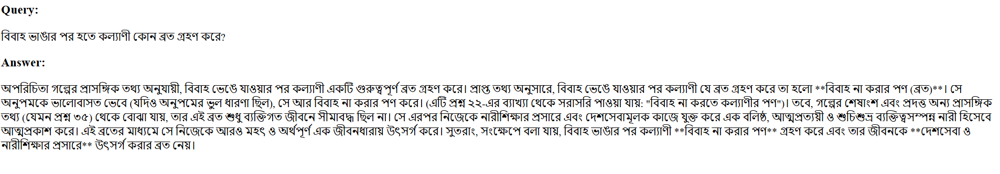

# Bangla RAG System

## Overview

This project implements a Retrieval-Augmented Generation (RAG) system for Bangla literature, enabling question-answering over the HSC26_Bangla_1st_Paper PDF. It uses OCR-based text extraction, preprocessing, vector-based semantic retrieval, and Gemini-2.5 for answer generation.

---

## Table of Contents

1. [Setup Guide](#setup-guide)
2. [Tools, Libraries & Packages](#tools-libraries--packages)
3. [Workflow](#workflow)
4. [Sample Queries & Outputs](#sample-queries--outputs)
5. [API Documentation](#api-documentation)
6. [Evaluation Matrix](#evaluation-matrix)
7. [Frequently Asked Questions](#frequently-asked-questions)

---

## Setup Guide

1. **Clone repository**:

   ```bash
   git clone https://github.com/salvirezwan/bangla-rag-system.git
   cd bangla-rag-system
   ```

2. **Create virtual environment**:

   ```bash
   python -m venv rag_env
   source rag_env/bin/activate  # Linux/macOS
   rag_env\Scripts\activate     # Windows PowerShell
   ```

3. **Install dependencies**:

   ```bash
   pip install -r requirements.txt
   ```

4. **Install Tesseract OCR**:

   - Download and install from [https://github.com/tesseract-ocr/tesseract](https://github.com/tesseract-ocr/tesseract)
   - Ensure `tesseract.exe` is in your `PATH` and set `TESSDATA_PREFIX` to the `tessdata` folder.
   - You might need to download **ben.traineddata** separately and paste it in your tessdata folder. Download link: [https://github.com/tesseract-ocr/tessdata/raw/main/ben.traineddata]

5. **Run OCR extraction**:

   ```bash
   python pdf_loader.py HSC26_Bangla_1st_Paper.pdf
   ```

   This produces `HSC26_Bangla_1st_Paper_ocr.txt`.

6. **Preprocess OCR output**:

   ```bash
   python preprocess_ocr.py
   ```

   This creates `HSC26_Bangla_1st_Paper_cleaned.txt`.

7. **Get GEMINI Key**:

   Get your free gemini-2.5-flash key from [https://aistudio.google.com/]. You can use it for limited number of times.

8. **Run tests and evaluation**:

   ```bash
   python test.py
   ```

   - Outputs individual test results in `output_test*.txt` and evaluation summary in `evaluation.txt`.

8. **Launch API**:

   ```bash
   python app.py
   ```

   Access UI at `http://127.0.0.1:5000/` or POST to `/api/ask`.

---

## Tools, Libraries & Packages

- **OCR**: [pytesseract](https://github.com/tesseract-ocr/tesseract) (with Tesseract engine) & [pdf2image]
- **Vector Embeddings**: [sentence-transformers/paraphrase-multilingual-MiniLM-L12-v2]
- **Similarity Search**: [faiss]
- **LLM**: Google Gemini-2.5-flash via `google-generativeai`
- **Web Framework**: Flask
- **Evaluation**: cosine similarity (via `sklearn`) on embeddings

---

## Workflow

1. ###  `pdf_loader.py` – OCR & Caching
   - Converts PDF to images using `pdf2image`
   - Performs OCR using Tesseract
   - Caches extracted Bangla text to avoid reprocessing

2. ###  `preprocess_ocr.py` – Preprocessing
   - Removes all English words and extraneous punctuation
   - Normalizes Bangla punctuation, line breaks, and whitespace
   - Produces clean, structured Bangla text

3. ###  `embed_store.py` – Embedding & Vector Storage
   - Splits cleaned Bangla text into manageable chunks (based on token length)
   - Embeds each chunk using `sentence-transformers/paraphrase-multilingual-MiniLM-L12-v2`
   - Stores embeddings in a **FAISS vector store** for fast similarity-based retrieval

4. ###  `query_engine.py` – Gemini Interface
   - Initializes Gemini Flash 2.5 using your API key
   - Provides the `ask_gemini(prompt)` function for response generation

5. ###  `rag_pipeline.py` – RAG Pipeline
   - Accepts a **Bangla user query**
   - Retrieves **top-7 similar chunks** using FAISS
   - Applies **keyword** reranking and selects **top-5** chunks
   - Builds a context-rich Bangla prompt for Gemini
   - Calls `ask_gemini()`

6. ###  `evaluate.py` – Evaluation
   - For each query-answer pair:
     - Measures **Groundedness**: similarity between answer and retrieved chunks
     - Measures **Relevance**: similarity between answer and query
   - Uses **Cosine Similarity** to compute evaluation scores

7. ###  `test.py` – Batch Testing & Logging
   - Loads multiple predefined test questions with expected answers
   - For each test case:
     - Calls `rag_answer()`
     - Logs the question, expected, answer, and retrieved chunks into a `.txt` file
   - Calls `evaluate.evaluate_with_results()` to evaluate the full set

8. ###  `app.py` – API & UI
   - Provides a FastAPI backend for:
     - Web Interface (UI)
     - REST API endpoint at `/api/ask`
   - Accepts Bangla & English queries and returns Gemini-powered answers in real-time

---

## Sample Queries & Outputs

### -Bangla:

**Query 1:**  
অনুপমের পিসতুতো ভাইয়ের নাম কী?

**Answer:**  
> প্রাসঙ্গিক তথ্যে দেওয়া আছে: অনুপমের পিসতুতো ভাইয়ের নাম- **বিনু**।

---

**Query 2:**  
কাকে অনুপমের ভাগ্য দেবতা বলে উল্লেখ করা হয়েছে?

**Answer:**  
> প্রদত্ত তথ্যে সরাসরি "অনুপমের ভাগ্য দেবতা" বলে কাউকে উল্লেখ করা না হলেও, গল্পের প্রেক্ষাপট এবং উল্লেখিত বর্ণনার ভিত্তিতে **অনুপমের মামাকেই** তার ভাগ্য দেবতা বলা যায়।

**কারণ:**  

১. **অনুপমের ব্যক্তিত্বের অভাব:**  
> উদ্দীপকের তথ্যে অনুপমকে কার্তিকেয়ের মতো মায়ের কাছাকাছি থেকে মাতৃআজ্ঞা পালনে ব্যস্ত থাকা এবং পরিণত বয়সেও তার স্বাধীন ব্যক্তিত্বের বিকাশ না হওয়ার কথা বলা হয়েছে। এর থেকে বোঝা যায়, সে নিজের জীবনের গুরুত্বপূর্ণ সিদ্ধান্ত গ্রহণে খুব একটা সক্ষম ছিল না, বরং অন্যের উপর নির্ভরশীল ছিল।

২. **মামার সর্বময় ক্ষমতা:**  
> বিয়ের আসরে অনুপমের মামার কার্যকলাপ বিশেষভাবে তুলে ধরা হয়েছে। তিনি আংটি, হার, জরি-জহরতের মাধ্যমে ভাবী জামাইয়ের (অনুপমের) মূল্য প্রদর্শন করে ভাবী শ্বশুরের সঙ্গে দেনা-পাওনার 'মোকাবিলা' করতে গিয়েছিলেন। এমনকি, গল্পের শীর্ষ-মুহূর্তে যখন সেনের কন্যা সম্প্রাদনে অসম্মতির ক্ষণ আসে (যা গহনা পরীক্ষার ফলস্বরূপ), তার মূলে ছিল এই মামারই একগুঁয়েমি ও সিদ্ধান্ত।

> অর্থাৎ, অনুপমের জীবনের সবচেয়ে গুরুত্বপূর্ণ একটি অধ্যায়, তার বিবাহ, সম্পূর্ণরূপে মামার নিয়ন্ত্রণাধীন ছিল। মামার সিদ্ধান্ত এবং কর্মকাণ্ডই অনুপমের ভাগ্যকে চালিত করছিল, সে ভালো বা মন্দ যাই হোক না কেন। তাই গল্পের এই প্রেক্ষাপটে অনুপমের মামাকেই তার ভাগ্য দেবতা হিসেবে চিহ্নিত করা যুক্তিযুক্ত।

---

**Query 3:**  
বিয়ের সময় কল্যাণীর প্রকৃত বয়স কত ছিল?

**Answer:**  
> প্রদত্ত প্রাসঙ্গিক তথ্যে বিয়ের সময় কল্যাণীর প্রকৃত বয়স সম্পর্কে সুনির্দিষ্ট কোনো তথ্য উল্লেখ করা হয়নি।

> তবে 'অপরিচিতা' গল্পে কল্যাণীকে একজন শিক্ষিতা, বুদ্ধিমতী ও আত্মমর্যাদাশীল তরুণী হিসেবে দেখানো হয়েছে। তৎকালীন সমাজ প্রেক্ষাপট ও তার চারিত্রিক দৃঢ়তা বিবেচনা করলে অনুমান করা যায়, বিয়ের সময় তার বয়স আনুমানিক **১৫ থেকে ১৭** বছরের মধ্যে ছিল। যদিও গল্পে সরাসরি তার বয়স বলা হয়নি, গল্পের বর্ণনা থেকে বোঝা যায়, সে কোনো ছোট বালিকা ছিল না, বরং একজন পরিণতবুদ্ধির তরুণী ছিল।

---


### -English:

**Query 1:**  
When was Rabindranath Tagore born?

**Answer:**  
> প্রদত্ত তথ্য অনুযায়ী, রবীন্দ্রনাথ ঠাকুর **৭ মে ১৮৬১ খ্রিষ্টাব্দে** (২৫ বৈশাখ ১২৬৮ বঙ্গাব্দ) জন্মগ্রহণ করেন।

---


## API Documentation

### POST `/api/ask`




---

## Evaluation Matrix

| Metric       | Definition                                                | Average |
| ------------ | --------------------------------------------------------- | --------------- |
| Groundedness | Cosine similarity between answer embedding and context embedding | 0.9153          |
| Relevance    | Cosine similarity between query embedding and context embedding  | 0.8568          |

Results are saved in `evaluation.txt`.

---

## Frequently Asked Questions (FAQ)


### 1. What method or library did you use to extract the text, and why? Did you face any formatting challenges with the PDF content?  
We used **Tesseract OCR** (via the `pytesseract` Python wrapper) together with `pdf2image` to convert PDF pages into images. This combination provides robust Bangla support (using the `ben.traineddata` language pack) and handles scanned or non‑text PDFs.  
**Formatting challenges:**  
Columns and headers sometimes split sentences mid‑line, and footnotes or page numbers inserted noise. We mitigated these by:  
1. Converting entire pages to high-resolution images.  
2. Cleaning the raw OCR output—removing English letters, stray symbols, and repeated punctuation—before downstream processing.

---


### 2. What chunking strategy did you choose (e.g. paragraph-based, sentence-based, character limit)? Why do you think it works well for semantic retrieval?  
- **Paragraph‑based with a 500‑character limit:** We split on double newlines, accumulate paragraphs until ~500 chars, then emit a chunk.  
- **Sentence‑boundary fallback:** If one paragraph is longer than 500 chars, we split at the first available Bangla danda (`।`) or period (`.`) to preserve sentence integrity.  
**Rationale:**  
- Paragraphs naturally group related ideas.  
- A ~500‑char window balances enough context for the embedding model without diluting relevance.  
- Sentence‑level splits ensure no chunk cuts off mid‑sentence, preserving semantic coherence.

---

### 3. What embedding model did you use? Why did you choose it? How does it capture the meaning of the text?  
We used **`sentence-transformers/paraphrase-multilingual-MiniLM-L12-v2`** because:  
- It’s compact and fast for CPU inference.  
- It’s trained on multilingual paraphrase data, yielding strong cross‑lingual embeddings that understand Bangla semantics.  
- It captures sentence‑ and paragraph‑level meaning by mapping semantically similar texts to nearby vectors in the embedding space.

---

### 4. How are you comparing the query with your stored chunks? Why did you choose this similarity method and storage setup?  
- We compute **inner‑product (cosine) similarity** on L2‑normalized embeddings using FAISS’s `IndexFlatIP`.  
- **Why FAISS + cosine?**  
  - Cosine similarity is standard for semantic search.  
  - FAISS offers efficient in‑memory nearest‑neighbor retrieval at scale.  
- We optionally rerank the top‑k by **keyword overlap** to combine semantic and lexical relevance.

---

### 5. How do you ensure that the question and the document chunks are compared meaningfully? What would happen if the query is vague or missing context?  
- **Meaningful comparison** is achieved by chunking at logical boundaries and using a strong embedding model.  
- **Reranking by keyword overlap** helps surface passages with direct term matches.  
- **Vague or contextless queries** may yield broad, general chunks; in such cases, our prompt instructs the LLM to respond “উত্তর পাওয়া যায়নি।” rather than hallucinate.

---

### 6. Do the results seem relevant? If not, what might improve them?  
- **Current performance** shows correct retrieval for 4 / 5 simple test cases.  
- **Potential improvements:**  
  1. **Sliding‑window chunking** (with overlap) to ensure boundary sentences aren’t lost.  
  2. **Larger or domain‑finetuned embeddings** (e.g. XLM‑R, Bangla‑specific models) for deeper literary nuance.  
  3. **Document metadata** (e.g. headings, question IDs) to guide retrieval.  

---


